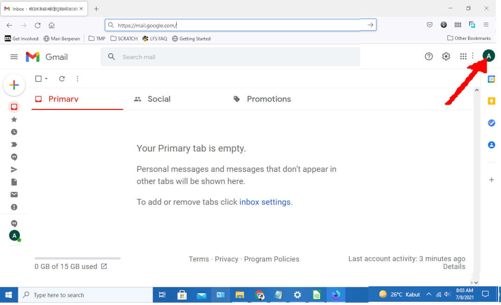
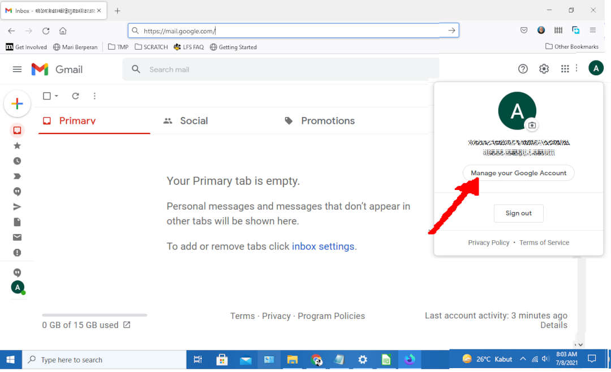
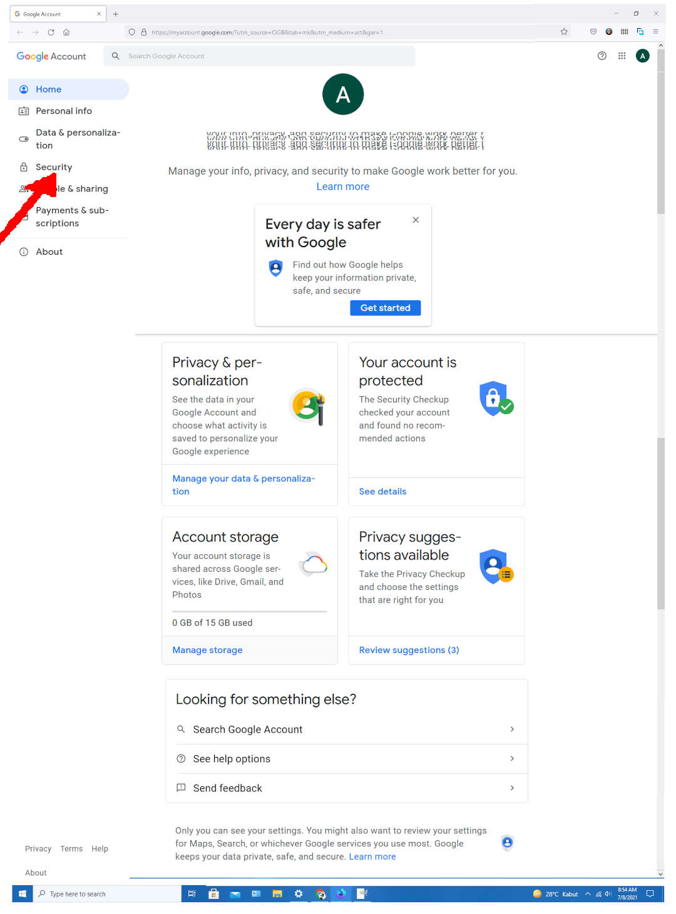
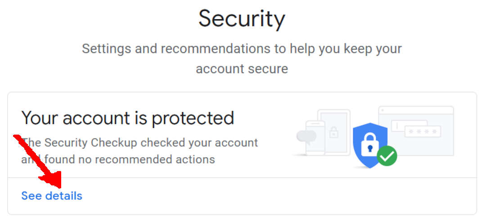
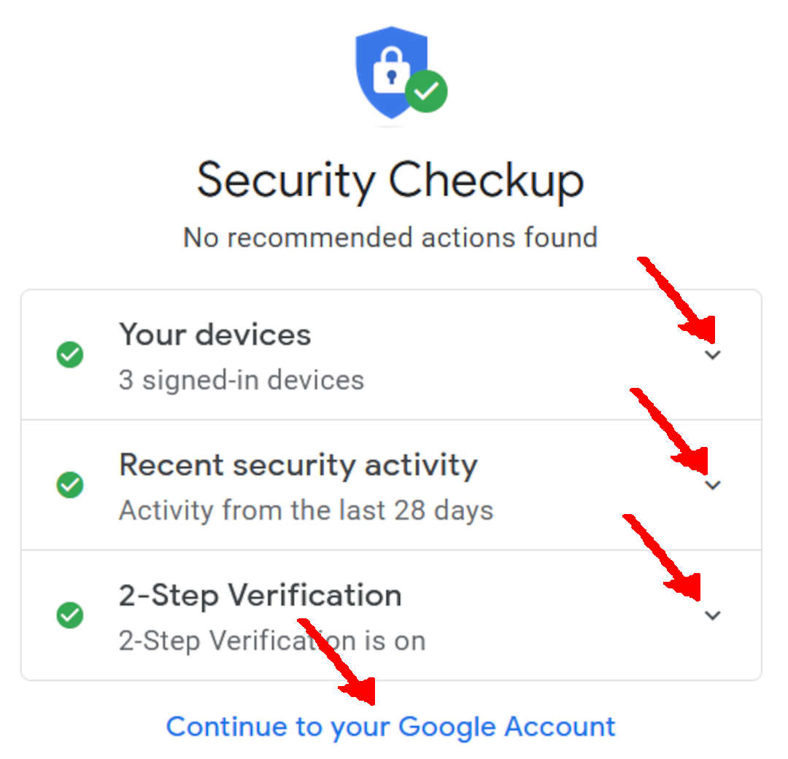

# Google Account Security Check

## (E.g.) Entering From GMAIL

* Select Google Account (Top Right Corner)

  

* Select "Manage your Google Account"

  

* Select "Security"

  

* See Details

  

* Security Checkup
  * Click for Details
  * REPEAT until "NO RECOMMENDED ACTION FOUND"

  

* Continue to your Google Account

  

